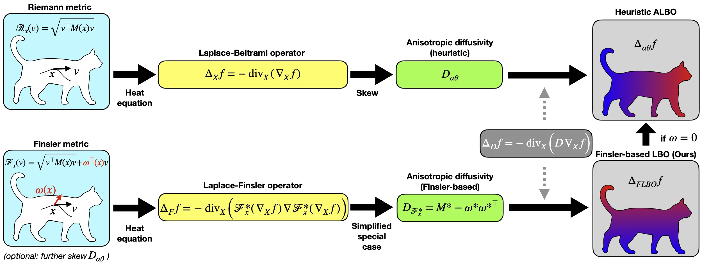

# Finsler-Laplace-Beltrami Operators with Application to Shape Analysis, CVPR 2024

Welcome to the official page of the paper [Finsler-Laplace-Beltrami Operators with Application to Shape Analysis (CVPR 2024)](https://arxiv.org/pdf/2404.03999.pdf). You can find a video presentation [here](https://www.youtube.com/watch?v=JCmblM9A1WI).  




## Abstract

The Laplace-Beltrami operator (LBO) emerges from studying manifolds equipped with a Riemannian metric. It is often called the Swiss army knife of geometry processing as it allows to capture intrinsic shape information and gives rise to heat diffusion, geodesic distances, and a multitude of shape descriptors. It also plays a central role in geometric deep learning. In this work, we explore Finsler manifolds as a generalization of Riemannian manifolds. We revisit the Finsler heat equation and derive a Finsler heat kernel and a Finsler-Laplace-Beltrami Operator (FLBO): a novel theoretically justified anisotropic Laplace-Beltrami operator (ALBO). In experimental evaluations we demonstrate that the proposed FLBO is a valuable alternative to the traditional Riemannian-based LBO and ALBOs for spatial filtering and shape correspondence estimation. We hope that the proposed Finsler heat kernel and the FLBO will inspire further exploration of Finsler geometry in the computer vision community.

## Citation
If you find our work useful in your research, please consider citing:

```bibtex
@inproceedings{weber2024finsler,
  title={Finsler-Laplace-Beltrami Operators with Application to Shape Analysis},
  author={Weber, Simon and Dag{\`e}s, Thomas and Gao, Maolin and Cremers, Daniel},
  booktitle={Proceedings of the IEEE/CVF Conference on Computer Vision and Pattern Recognition},
  pages={3131--3140},
  year={2024}
}
```
### Shape Matching Application

##### Discretization: An Example

The Matlab file ```calc_flbo.m``` derives the shear and stiffness matrices for the FLBO. 

##### Shape Matching

As a toy illustration of our theoretical insights, we plug the discretized FLBO into Chebyshev spectral CNNs, whose official implementation can be found [on this Github](https://github.com/GCVGroup/ACSCNN), with the following citation:
```bibtex
@inproceedings{li2020shape,
  title={Shape correspondence using anisotropic Chebyshev spectral CNNs},
  author={Li, Qinsong and Liu, Shengjun and Hu, Ling and Liu, Xinru},
  booktitle={Proceedings of the IEEE/CVF conference on Computer Vision and Pattern Recognition},
  pages={14658--14667},
  year={2020}
}
```
